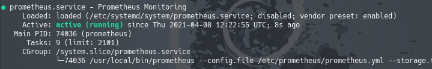
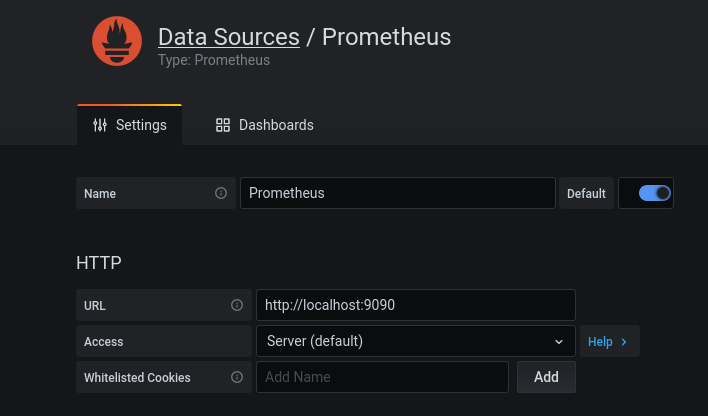
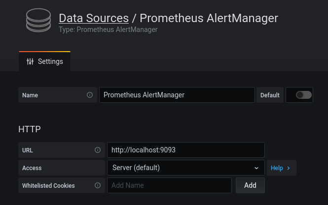
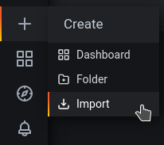
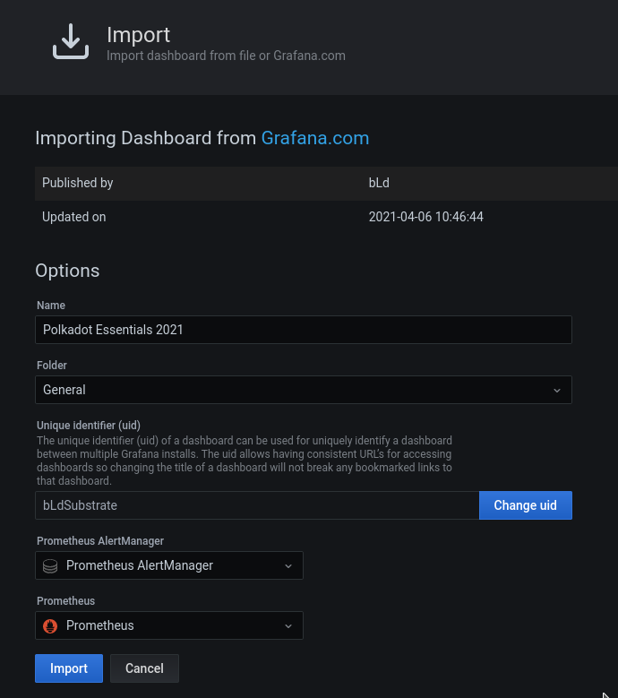

# Collator monitoring & alarming

This document details the Monitoring and Alarming Services for the  
t3rn project. We intend to implement these metrics instrumentation and  
visualization using tools such as [Prometheus](https://prometheus.io/) and  
[Grafana](https://grafana.com/). Susbtrate already has a built-in Prometheus  
Publisher which we intend to utilize.

## Overview

The general overview of the solution shall be in the form below:


## Specifications

Here is the description of the components that make up our monitoring and alerting system:  
**Prometheus:** is the central module; it pulls metrics from different sources to provide them to the Grafana dashboard and Alert Manager.  
**Grafana** is the visual dashboard tool that we access from the outside (through SSH tunnel to keep the node secure).  
**Alert Manager** listens to Prometheus metrics and pushes an alert as soon as a threshold is crossed (disk full, no network, bad service status, CPU % usage for example).  
**Substrate node** (t3rn) natively provides metrics for monitoring.
**Node exporter** provides hardware metrics of the dashboard.  
**Process exporter** provides process metrics for the dashboard (optional).

## Goals

The goal is to achieve the monitoring of the following metrics:

> #### Monitoring
>
> ##### per collator:
>
> - peer count
> - latest collation block
> - syncing y/n (maybe sync height)
> - pending extrinsics
> - free disk space
> - network connectivity
> - systemd service status
>
> ##### Across collators:
>
> - time since last block
> - best block
> - finalized block
>
> #### Alarming/Alerting Services
>
> - telegram alerting for fatal errors (disk full, no network, bad service  
>   status, no more collations)

**Note:** The list above is not exhaustive and more metrics can be monitored  
among the above

## Let's get started

Let us start by installing the pre-requisites:

```
sudo apt update
sudo apt upgrade
sudo apt install -y adduser libfontconfig1

```

<br>

**Download** the latest releases of [Prometheus](https://prometheus.io/download/), [Process exporter](https://github.com/ncabatoff/process-exporter/releases) and
[Grafana](https://grafana.com/grafana/download) from their respective download
pages.

```
wget https://github.com/prometheus/prometheus/releases/download/v2.35.0/prometheus-2.35.0.linux-amd64.tar.gz
wget https://github.com/prometheus/node_exporter/releases/download/v1.3.1/node_exporter-1.3.1.linux-amd64.tar.gz
wget https://github.com/ncabatoff/process-exporter/releases/download/v0.7.10/process-exporter-0.7.10.linux-amd64.tar.gz
wget https://github.com/prometheus/alertmanager/releases/download/v0.24.0/alertmanager-0.24.0.linux-amd64.tar.gz
wget https://dl.grafana.com/oss/release/grafana_8.5.2_amd64.deb

```

<br>

**Extract** the downloaded files:

```
tar xvf prometheus-\*.tar.gz
tar xvf node_exporter-\*.tar.gz
tar xvf process-exporter-\*.tar.gz
tar xvf alertmanager-\*.tar.gz
sudo dpkg -i grafana\*.deb
```

<br>

**Copy** the extracted files into `/usr/local/bin:`

```
sudo cp ./prometheus-\*.linux-amd64/prometheus /usr/local/bin/
sudo cp ./prometheus-\*.linux-amd64/promtool /usr/local/bin/
sudo cp -r ./prometheus-\*.linux-amd64/consoles /etc/prometheus
sudo cp -r ./prometheus-\*.linux-amd64/console_libraries /etc/prometheus
sudo cp ./node_exporter-\*.linux-amd64/node_exporter /usr/local/bin/
sudo cp ./process-exporter-\*.linux-amd64/process-exporter /usr/local/bin/
sudo cp ./alertmanager-\*.linux-amd64/alertmanager /usr/local/bin/
sudo cp ./alertmanager-\*.linux-amd64/amtool /usr/local/bin/
```

**Install** the Alert manager plugin for Grafana:

```
sudo grafana-cli plugins install camptocamp-prometheus-alertmanager-datasource
```

<br>

### Create dedicated users:

```
sudo useradd --no-create-home --shell /usr/sbin/nologin prometheus
sudo useradd --no-create-home --shell /usr/sbin/nologin node_exporter
sudo useradd --no-create-home --shell /usr/sbin/nologin process-exporter
sudo useradd --no-create-home --shell /usr/sbin/nologin alertmanager
```

<br>  
  
### Create directories:
```
sudo mkdir /var/lib/prometheus  
sudo mkdir /etc/process-exporter  
sudo mkdir /etc/alertmanager  
sudo mkdir /var/lib/alertmanager  
```

<br>

### Change the ownership for all directories:

```
sudo chown prometheus:prometheus /etc/prometheus/ -R
sudo chown prometheus:prometheus /var/lib/prometheus/ -R
sudo chown prometheus:prometheus /usr/local/bin/prometheus
sudo chown prometheus:prometheus /usr/local/bin/promtool
sudo chown node_exporter:node_exporter /usr/local/bin/node_exporter
sudo chown process-exporter:process-exporter /etc/process-exporter -R
sudo chown process-exporter:process-exporter /usr/local/bin/process-exporter
sudo chown alertmanager:alertmanager /etc/alertmanager/ -R
sudo chown alertmanager:alertmanager /var/lib/alertmanager/ -R
sudo chown alertmanager:alertmanager /usr/local/bin/alertmanager
sudo chown alertmanager:alertmanager /usr/local/bin/amtool
```

<br>

**Finally**, clean up the download directory:

```
rm -rf ./prometheus\*
rm -rf ./node_exporter\*
rm -rf ./process-exporter\*
rm -rf ./alertmanager\*
rm -rf ./grafana\*
```

<br>

## Configuration

### Prometheus

Edit the prometheus configuration file and add all the modules:

```
sudo nano /etc/prometheus/prometheus.yml
```

Paste the code snippets below and save:

```
global:
  scrape_interval: 15s
  evaluation_interval: 15s

rule_files:
  - 'collator-rules.yml'

alerting:
  alertmanagers:
  - static_configs:
    - targets:
      - localhost:9093

scrape_configs:
  - job_name: "prometheus"
    scrape_interval: 5s
    static_configs:
      - targets: ["localhost:9090"]
  - job_name: "substrate_node"
    scrape_interval: 5s
    static_configs:
      - targets: ["localhost:9615"]
  - job_name: "node_exporter"
    scrape_interval: 5s
    static_configs:
      - targets: ["localhost:9100"]
  - job_name: "process-exporter"
    scrape_interval: 5s
    static_configs:
      - targets: ["localhost:9256"]
```

- `scrape_interval` defines how often Prometheus scrapes targets, while  
  `evaluation_interval` controls how often the software will evaluate rules.
- `rule_files` set the location of Alert manager rules we will add next.
- `alerting` contains the alert manager target.
- `scrape_configs` contain the services Prometheus will monitor.

### Alert Rules

Create the alert rules file:

```
sudo touch /etc/prometheus/collator-rules.yml
sudo nano /etc/prometheus/collator-rules.yml
```

Add the rules below and save:

```
groups:
  - name: t3rn.rules
    rules:
    ###########################################################################
    # Block production
    ###########################################################################

      - alert: BlockProductionSlow
        expr: substrate_block_height{status="sync_target"} > 0 and increase(substrate_block_height{status="best"}[1m]) < 1
        for: 3m
        labels:
          severity: warning
        annotations:
          message: "Best block on instance {{ $labels.instance }} increases by
          less than 1 per minute for more than 3 minutes."
      - alert: ProlongedBlockProductionSlow
        expr: substrate_block_height{status="sync_target"} > 0 and increase(substrate_block_height{status="best"}[1m]) < 1
        for: 10m
        labels:
          severity: critical
        annotations:
          message: "Best block on instance {{ $labels.instance }} increases by
          less than 1 per minute for more than 10 minutes."
    ##############################################################################
    # Block finalization
    ##############################################################################
      - alert: BlockFinalizationSlow
        expr: substrate_block_height{status="sync_target"} > 0 and increase(substrate_block_height{status="finalized"}[1m]) < 1
        for: 3m
        labels:
          severity: warning
        annotations:
          message: "Finalized block on instance {{ $labels.instance }}
          increases by less than 1 per minute for more than 3 minutes."
      - alert: ProlongedBlockFinalizationSlow
        expr: substrate_block_height{status="sync_target"} > 0 and increase(substrate_block_height{status="finalized"}[1m]) < 1
        for: 10m
        labels:
          severity: critical
        annotations:
          message: "Finalized block on instance {{ $labels.instance }} increases by
          less than 1 per minute for more than 10 minutes."
      - alert: BlockFinalizationLaggingBehind
        expr: substrate_block_height{status="sync_target"} > 0 and (substrate_block_height{status="best"} - ignoring(status) subst>
        for: 8m
        labels:
          severity: critical
        annotations:
          message: "Block finalization on instance {{ $labels.instance }} is
          behind block production by {{ $value }} for more than 8 minutes."


    ##############################################################################
   # Transaction queue
    ##############################################################################
      - alert: TransactionQueueSizeIncreasing
        expr: increase(substrate_sub_txpool_validations_scheduled[5m]) - increase(substrate_sub_txpool_validations_>
        for: 10m
        labels:
          severity: warning
        annotations:
          message: "The transaction pool size on node {{ $labels.instance }} has
          been monotonically increasing for more than 10 minutes."
      - alert: ProlongedTransactionQueueSizeIncreasing
        expr: increase(substrate_sub_txpool_validations_scheduled[5m]) - increase(substrate_sub_txpool_validations_>
        for: 30m
        labels:
          severity: warning
        annotations:
          message: "The transaction pool size on node {{ $labels.instance }} has
          been monotonically increasing for more than 30 minutes."
      - alert: TransactionQueueSizeHigh
        expr: substrate_sub_txpool_validations_scheduled - substrate_sub_txpool_validations_finished > 10000
        for: 5m
        labels:
          severity: warning
        annotations:
          message: "The transaction pool size on node {{ $labels.instance }} has
          been above 10_000 for more than 5 minutes."

    ##############################################################################
    # Networking
    ##############################################################################
      - alert: NumberOfPeersLow
        expr: substrate_sub_libp2p_peers_count < 3
        for: 3m
        labels:
          severity: warning
        annotations:
          message: "The node {{ $labels.instance }} has less than 3 peers for more
          than 3 minutes"
      - alert: NumberOfPeersLow
        expr: substrate_sub_libp2p_peers_count < 3
        for: 15m
        labels:
          severity: critical
        annotations:
          message: "The node {{ $labels.instance }} has less than 3 peers for more
          than 15 minutes"
      - alert: NoPeerToPeerConnections
        expr: increase(substrate_sub_libp2p_incoming_connections_total{chain="calamari",job=~".*collator.*"}[20m]) >
        labels:
          severity: warning
        annotations:
          message: "The collator node {{ $labels.instance }} has not received any
          new incoming TCP connection on the p2p port in the last 20 minutes."


    ##############################################################################
    # System
    ##############################################################################
      - alert: NumberOfFileDescriptorsHigh
        expr: node_filefd_allocated{chain!=""} > 10000
        for: 3m
        labels:
          severity: warning
        annotations:
          message: "The node {{ $labels.instance }} has more than 10_000 file
          descriptors allocated for more than 3 minutes"
      - alert: InstanceDown
        expr: up == 0
        for: 5m
        labels:
          severity: critical
        annotations:
          message: "[{{ $labels.instance }}] of job [{{ $labels.job }}] has been
          down for more than 1 minute."
      - alert: high cpu load
        expr: 100 - (avg by(instance) (rate(node_cpu_seconds_total{mode="idle"}[2m])) * 100) > 80
        labels:
          severity: warning
        annotations:
          message: "CPU load is > 80%\n  VALUE = {{ $value }}\n  LABELS: {{ $labels }}"
      - alert: HostFsCapacity
        expr: 100 - ((node_filesystem_avail_bytes{mountpoint="/",fstype!="rootfs"} * 100) / node_filesystem_size_by>
        for: 0m
        labels:
          severity: warning
        annotations:
          summary: "Host FS storage > 50% (instance [{{ $labels.instance }}])"
          description: "File storage available is > 50%\n  VALUE = {{ $value }}\n  LABELS: {{ $labels }}"
      ##############################################################################
    # Others
    ##############################################################################
      - alert: AuthorityDiscoveryDiscoveryFailureHigh
        expr: substrate_authority_discovery_handle_value_found_event_failure / ignoring(name) substrate_authority_d>
        for: 2h
        labels:
          severity: warning
        annotations:
          message: "Authority discovery on node {{ $labels.instance }} fails to
          process more than 50 % of the values found on the DHT for more than 2 hours."
      - alert: UnboundedChannelPersistentlyLarge
        expr: ((substrate_unbounded_channel_len{action="send"} - ignoring(action) substrate_unbounded_channel_len{a>
        for: 5m
        labels:
          severity: warning
        annotations:
          message: "Channel {{ $labels.entity }} on node {{ $labels.instance }}
          contains more than 200 items for more than 5 minutes. Node might be frozen."
      - alert: UnboundedChannelVeryLarge
        expr: ((substrate_unbounded_channel_len{action="send"} - ignoring(action) substrate_unbounded_channel_len{a>
        labels:
          severity: warning
        annotations:
          message: "Channel {{ $labels.entity }} on node {{ $labels.instance }}
          contains more than 15000 items."

```

Check the rule files:

```
promtool check rules /etc/prometheus/collator-rulles.yml
```

Check the **Prometheus** configuration file

```
promtool check config /etc/prometheus/prometheus.yml
```

<br>

### Process Exporter

Configure the process exporter using the configuration below. First create the
config file

```
sudo touch /etc/process-exporter/config.yml
sudo nano /etc/process-exporter/config.yml
```

Add the following lines

```
process_names:
  - name: "{{.Comm}}"
    cmdline:
    - '.+'

```

<br>

### Telegram setup

Create a Telegram [Bot](https://core.telegram.org/bots#6-botfather) to obtain the  
`bot_token`. But we shall use [Telepush](https://telepush.dev/) for testing.

<br>

### Alert Manager

Setup the alert manager to call the external telegram service

```
sudo touch /etc/alertmanager/alertmanager.yml
sudo nano /etc/alertmanager/alertmanager.yml
```

<br>

Open a new chat with [TelepushBot](https://t.me/MiddlemanBot) and simply send `/start`.  
You’ll receive a token. Keep it for the next step.

```
global:
 resolve_timeout: 1m

# catch-all route to receive and handle all incoming alerts
route:
  group_by: ['alertname']
  group_wait: 10s       # wait up to 10s for more alerts to group them
  receiver: 'telepush'  # see below

# telepush configuration here
receivers:
- name: 'telepush'
  webhook_configs:
  - url: 'https://telepush.dev/api/inlets/alertmanager/<YOUR_TOKEN>'    # add your Telepush token here
    http_config: global.http_config

```

<br>

### Setting services

Create `systemd` services to handle restarting all the services created above.

#### Node

```
sudo useradd --no-create-home --shell /usr/sbin/nologin t3rn
sudo cp ./t3rn /usr/local/bin
sudo chown t3rn:t3rn /usr/local/bin/t3rn
```

Create a **dedicated directory for the chain storage data**:

```
sudo mkdir /var/lib/t3rn
sudo chown t3rn:t3rn /var/lib/t3rn
```

Create and open the node service file:

```
sudo touch /etc/systemd/system/t3rn.service
sudo nano /etc/systemd/system/t3rn.service

```

Add the lines and match with your node configuration

```
[Unit]
  Description=T3rn Collator

[Service]
  User=t3rn
  Group=t3rn

ExecStart=/usr/local/bin/t3rn \
  --collator \
  --rpc-cors all \
  --name <Your Collator Name> \
  --base-path /var/lib/t3rn

Restart=always
RestartSec=120

[Install]
WantedBy=multi-user.target
```

Reload daemon, start and check the service:

```
sudo systemctl daemon-reload
sudo systemctl start t3rn.service
sudo systemctl status t3rn.service
```

Once the service is running, enable the service:

```
sudo systemctl enable t3rn.service
```

To check the service log:

```
journalctl -f -u t3rn -n100
```

**Note** To purge chain:

```
/usr/local/bin/plasm purge-chain
```

<br>

### Prometheus

Create and open the Prometheus service file:

```
sudo touch /etc/systemd/system/prometheus.service
sudo nano /etc/systemd/system/prometheus.service
```

Add the following lines:

```
[Unit]
  Description=Prometheus Monitoring
  Wants=network-online.target
  After=network-online.target

[Service]
  User=prometheus
  Group=prometheus
  Type=simple
  ExecStart=/usr/local/bin/prometheus \
  --config.file /etc/prometheus/prometheus.yml \
  --storage.tsdb.path /var/lib/prometheus/ \
  --web.console.templates=/etc/prometheus/consoles \
  --web.console.libraries=/etc/prometheus/console_libraries
  ExecReload=/bin/kill -HUP $MAINPID

[Install]
  WantedBy=multi-user.target

```

<br>

### Node Exporter

Create and open the node exporter service file

```
sudo touch /etc/systemd/system/node_exporter.service
sudo nano /etc/systemd/system/node_exporter.service

```

Add the following lines:

```
[Unit]
  Description=Node Exporter
  Wants=network-online.target
  After=network-online.target

[Service]
  User=node_exporter
  Group=node_exporter
  Type=simple
  ExecStart=/usr/local/bin/node_exporter

[Install]
  WantedBy=multi-user.target

```

<br>

### Process Exporter

Create and open the Process exporter service file:

```
sudo touch /etc/systemd/system/process-exporter.service
sudo nano /etc/systemd/system/process-exporter.service

```

Add the following lines:

```
[Unit]
  Description=Process Exporter
  Wants=network-online.target
  After=network-online.target

[Service]
  User=process-exporter
  Group=process-exporter
  Type=simple
  ExecStart=/usr/local/bin/process-exporter \
  --config.path /etc/process-exporter/config.yml

[Install]
WantedBy=multi-user.target

```

<br>

### Alert manager

Create and open the Alert manager service file:

```
sudo touch /etc/systemd/system/alertmanager.service
sudo nano /etc/systemd/system/alertmanager.service

```

Add the following lines:

```
[Unit]
  Description=AlertManager Server Service
  Wants=network-online.target
  After=network-online.target

[Service]
  User=alertmanager
  Group=alertmanager
  Type=simple
  ExecStart=/usr/local/bin/alertmanager \
  --config.file /etc/alertmanager/alertmanager.yml \
  --storage.path /var/lib/alertmanager \
  --web.external-url=http://localhost:9093 \
  --cluster.advertise-address='0.0.0.0:9093'

[Install]
WantedBy=multi-user.target

```

<br>

### Grafana

Grafana service is automatically created during the intallation process for Grafana. So  
it's not neccessary to create same again

<br>

## Launch and activate the services

Reload the daemon to configure the services at `systemd`

```
sudo systemctl daemon-reload
```

Start all services:

```
sudo systemctl start prometheus.service
sudo systemctl start node_exporter.service
sudo systemctl start process-exporter.service
sudo systemctl start alertmanager.service
sudo systemctl start grafana-server

```

Check that all services are in `running` state:

```
systemctl status prometheus.service
systemctl status node_exporter.service
systemctl status process-exporter.service
systemctl status alertmanager.service
systemctl status grafana-server

```

A service working fine should look like this:



<br>

Activate all the services:

```
sudo systemctl enable prometheus.service
sudo systemctl enable node_exporter.service
sudo systemctl enable process-exporter.service
sudo systemctl enable alertmanager.service
sudo systemctl enable grafana-server

```

<br>

## Test alert manager

Run this command to fire an alert:

```
curl -H "Content-Type: application/json" -d '[{"labels":{"alertname":"Test"}}]' localhost:9093/api/v1/alerts
```

<br>

## View on Grafana Dashboard

Once Grafana service is running, navigate to _https://localhost:3000/_ and  
Log in (default user admin and password admin). Then navigate to _https://localhost:3000/datasource_  
and select `Prometheus` as a datasource.



Just fill the URL with http://localhost:9090 and click Save & Test.

<br>  
Then add a new data source and search for Alert manager



Fill the URL with http://localhost:9093 and click Save & Test.

<br>

## Import the dashboard

Open the New menu:



We shall use a [pre-built](https://grafana.com/grafana/dashboards/13840) dashboard.



<br>

Select the Prometheus and AlertManager sources and click Import.
In the dashboard selection, make sure you select:

- **Chain Metrics** Choose `substrate`
- **Chain Instance Host**: localhost:9615 to point the chain data scrapper
- **Chain Process Name**: the name of your node binary
